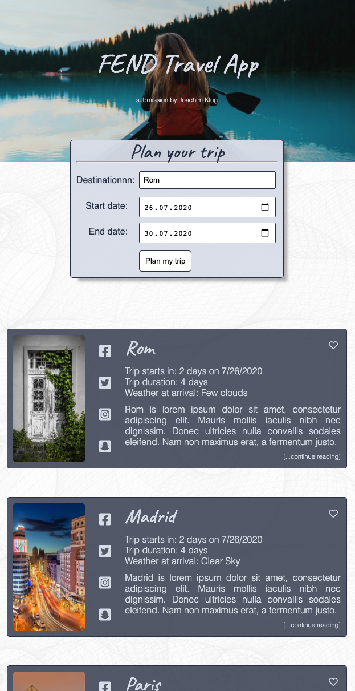

# UDACITY FEND Submission / Capstone Project

## About this project

It was a lot of fun but took me some time to develop. I know that not everything is perfect but there is a need to
balance my available time between finalizing this project and to continue self learning also in other areas.

## Used APIs

- geonames.org - to get location information (coordinates) for a specific location
- weatherbit.io - to get weather forecast data
- pixaby.com - to show thumbnails

### API Key configuration

API Keys are configured in the `.env` file. Please copy the `.env_template` file to `.env` and fill the required
configuration parameters.

## Project structure

The project is mainly split into following structure. Webpack is used to bundle modules and facilitaty
development/build. The `src` folder holds all sources and is split into `client`and `server` code.

```
.
├── README.md
├── images
├── package-lock.json
├── package.json
src
├── client
│   ├── assets
│   │   ├── fish-seamless.png
│   │   └── pattern-seamless.jpg
│   ├── index.js
│   ├── js
│   │   ├── helperFunctions.js
│   │   ├── resultElement.js
│   │   └── travelApp.js
│   ├── styles
│   │   ├── _colors.scss
│   │   ├── _fonts.scss
│   │   ├── base.scss
│   │   ├── footer.scss
│   │   ├── header.scss
│   │   ├── main.scss
│   │   └── resets.scss
│   ├── tests
│   │   └── frontend.spec.js
│   └── views
│       └── index.html
├── .gititnore
├── .env
├── .env_template
└── server
    ├── geolocations.js
    ├── index.js
    ├── pictures.js
    ├── tests
    │   └── backend.spec.js
    ├── validators.js
    └── weather.js
├── webpack.dev.js
└── webpack.prod.js
```

### Client

`client` holds all information to build the frontend.

### Server

`server` holds all information to build the backend. All external APIs are requested through the backend to not leak any
keys.

## Running the project in production mode

1. Install required node packages: `npm install`
1. Copy the `.env_template` file to `.env` and fill the required configuration parameters. (Already done for this
   submission)
1. Make an optimized production build: `npm run build-prod`. This will create a dist folder with all assets.
1. Start the backend services: `npm run start`. The used port is shown and can be changed in `.env`. The backend server
   will also host the homepage.
1. Open the webpage with your browser. Example: http://localhost:8081

## Running the project in development mode

1. Install required node packages: `npm install`
1. Copy the `.env_template` file to `.env` and fill the required configuration parameters. (Already done for this
   submission)
1. Make an optimized production build: `npm run build-dev`. This will launch a web browser and connect to the dev
   server.
1. Start the backend services: `npm run start`. The used port is shown and can be changed in `.env`. The backend server
   will also host the homepage.

## Testing the project

Jest was used to create tests. Frontend and Backend do have their separate test folders.

To run both tests use `npm run test`

## Screenshots


